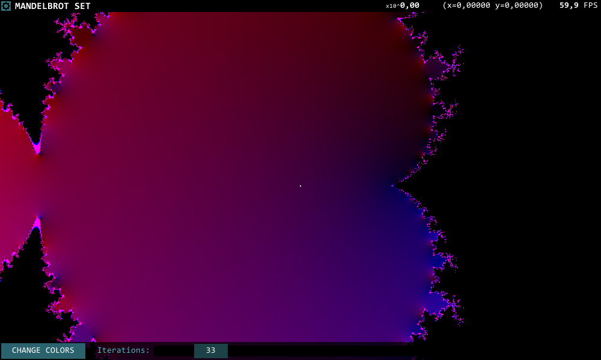

# Mandelbrot Explorer

## Description

A simple application that allows you to explore The Mandelbrot Set.

## Goals

Application...

* renders the Mandelbrot Set in real time.
* uses compute shaders.

## Instructions

| Key                        | Action                            |
| -------------------------- | --------------------------------- |
| `RMB` (Right mouse button) | Moves the crosshair over the set. |
| Mouse wheel                | Changes zoom.                     |
| `Esc`                      | Exits / Quits application.        |
| `F11`                      | Enters / exits full screen mode.  |

Top right corner contains information about: zoom (as exponential of 10), position of the crosshair and current frames per second. Bottom bar lets control a color of the set and number of iterations of recursive formula.

**Warning**: If your PC started making strange noises after starting the app, there is no problem. That's a sound of fans in your PC cooling electronics performing calculations. If it keeps bothering you, you can decrease number of iterations or make the window smaller.

## Implementation

While creating this application, my main goal was to use the *compute shaders*. Each frame application dispatches `JuliaComputeShader` to calculate the Mandelbrot Set.

To use as little resource as possible, application create new `RenderTexture` each time the window is resized.
